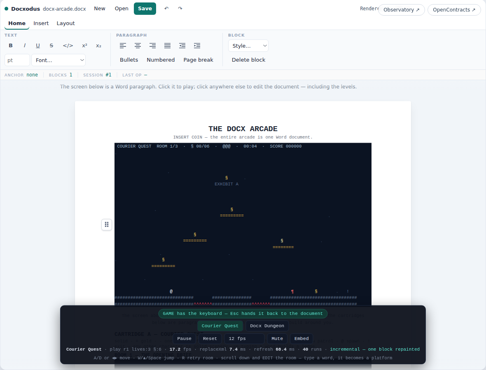
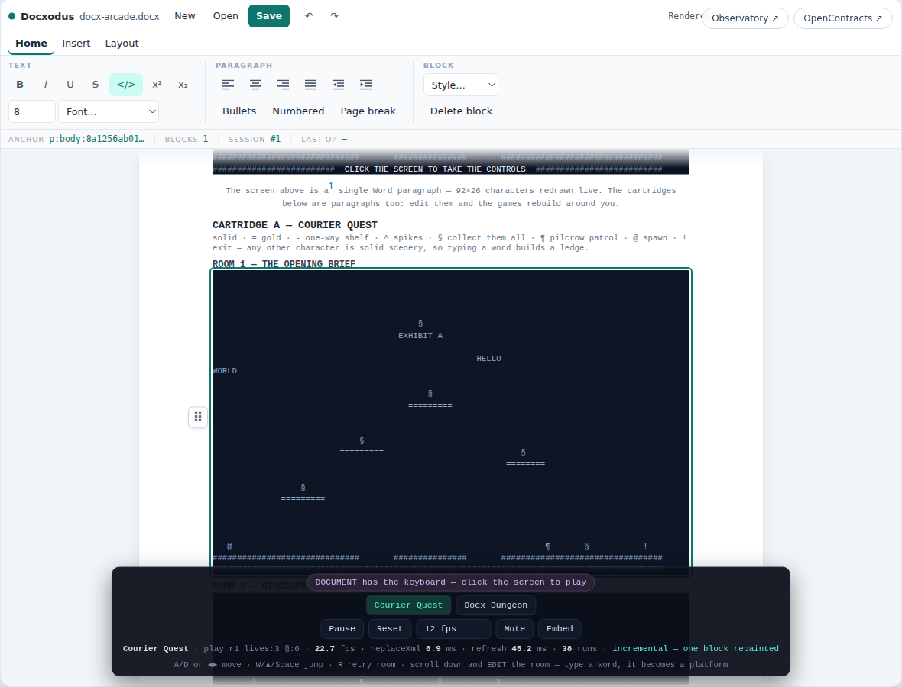
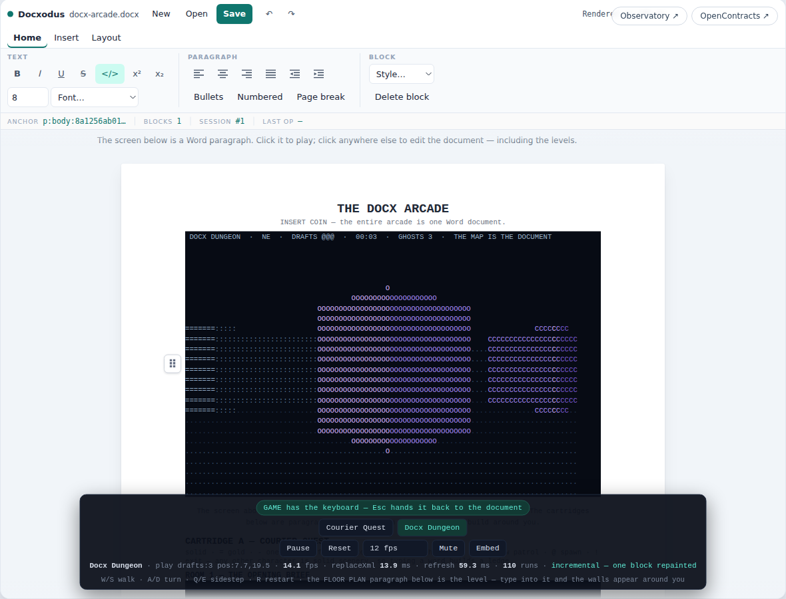

# The Docx Arcade

> Two playable games running **inside a live Word document** — the same
> Docxodus engine that renders DOCX files in OpenContracts, driven hard
> enough to be a game console.

**[▶ Play it here](docx-arcade/)** — nothing to install; the whole thing runs
client-side in your browser tab.

The screen is a single Word paragraph, 92×26 characters of colored runs,
redrawn ~12 times per second through `DocxSession.raw.replaceXml` +
`DocxEditor.refresh()` (the same Unid-preserving trick as the
[Docx Observatory](https://jsv4.github.io/Docxodus/demo/observatory.html)).
The step further: **the levels are paragraphs in the same document.** Scroll
down, click into a room, and type — the editor commits your text and the game
rebuilds the world around you, while it runs.

## Cartridge A — Courier Quest

A single-screen platformer. You are `@`, a process server: collect every `§`,
stomp the pilcrows `¶`, unseal the exit `!`. Any character that isn't part of
the legend is solid scenery — typing a word into the room paragraph builds a
ledge you can stand on.





## Cartridge B — Docx Dungeon

A first-person raycaster whose entire map is the FLOOR PLAN paragraph below
the screen. Letters in the plan become walls textured with themselves —
the founders' pillars below spell DOCX. Find the `E` door; the pilcrow
ghosts disagree.



## Controls

| Key | Courier Quest | Docx Dungeon |
| --- | --- | --- |
| `A`/`D` or `◄`/`►` | move | turn |
| `W`/`▲`/`Space` | jump | walk (W/S) |
| `Q`/`E` | — | sidestep |
| `R` | retry room | restart floor |
| `P` / `M` | pause / mute | pause / mute |
| `Esc` | give the keyboard back to the document | same |

Click the screen paragraph to take the controls; click anywhere else to edit
the document — including the levels. A connected gamepad works too. Because it
is only a document: **Undo rewinds frame by frame** and the ribbon's **Save**
downloads whatever is on screen, mid-jump included, as a valid `.docx`.

## Embedding it anywhere

The demo is a static page with no backend — it embeds in any site that can
host an iframe (the **Embed** button in the dock copies this):

```html
<iframe
  src="https://open-source-legal.github.io/OpenContracts/demo/docx-arcade/"
  width="1060" height="800"
  style="border:0;border-radius:12px;overflow:hidden"
  title="The Docx Arcade — games running inside a live Word document"
  allow="gamepad; fullscreen" loading="lazy"></iframe>
```

Query params: `?game=dungeon` boots straight into the raycaster; `?fps=8`
changes the frame pacing; `?engine=<url>` overrides the pinned Docxodus build.

## How it works

Everything lives in `docs/demo/docx-arcade/` and deploys verbatim with the
docs site — no build step, no server, no separate machinery:

- `index.html` — host page; mounts the stock ribbon editor
  (`createRibbonEditor`, docxodus 9.7.0 from jsDelivr) exactly like the
  Observatory's host page.
- `engine.js` — cell grid → OOXML frame writer (`frameXml`), cartridge
  writer/readers (`cartridgeXml`, `paraXmlToRows`, `domBlockToRows`), banner
  font, input, and a pocket square-wave synth.
- `arcade.js` — seeds the document through the agentic `DocxSession` surface
  (`seedArcade`) and drives the frame/sim/poll loop (`startArcade`).
- `courier-quest.js` / `docx-dungeon.js` — the two game cartridges.

Three details worth knowing before you fork it into your own docx-game:

1. **Run budget.** Every color change inside a row is its own `w:r`, and runs
   dominate render cost. Both games shade in coarse distance/row bands and
   let glyphs (not colors) carry texture, staying under ~150 runs per frame.
2. **Blur commits.** The editor commits typed text to the session on blur, so
   the driver reads the *DOM* of a dirty cartridge block between commits
   (`domBlockToRows`) — that is what makes walls rise keystroke by keystroke.
3. **NBSP blanks.** Blank level rows are seeded as non-breaking spaces:
   ordinary trailing spaces hang under `pre-wrap` and refuse a caret, which
   would make empty sky untypeable.
