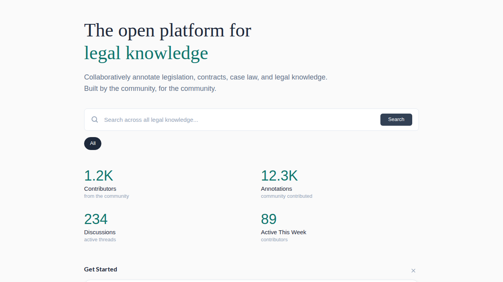

# Documentation Screenshots

OpenContracts uses **auto-generated screenshots** captured during Playwright component tests to keep documentation images in sync with the actual UI. There are two distinct lifecycles:

| | `docScreenshot` | `releaseScreenshot` |
|---|---|---|
| **Purpose** | Evergreen docs (README, guides) | Release notes (frozen at release time) |
| **Output** | `docs/assets/images/screenshots/auto/` (gitignored) | `docs/assets/images/screenshots/releases/{version}/` |
| **Lifecycle** | Regenerated locally on demand; not committed | Committed once and frozen |
| **Overwrites?** | Always | Never (write-once) |

## Utility API

Source: `frontend/tests/utils/docScreenshot.ts`

### `docScreenshot(page, name, options?)`

Captures an evergreen screenshot into `docs/assets/images/screenshots/auto/`. The directory is gitignored — regenerate locally when you want fresh images for the docs site.

```ts
import { docScreenshot } from "./utils/docScreenshot";

await docScreenshot(page, "landing--hero-section--anonymous");
await docScreenshot(page, "badges--modal--auto-award", { element: component });
await docScreenshot(page, "corpus--list-view--with-items", { fullPage: true });
```

**Naming convention** — use `--` (double-dash) to separate hierarchical segments:

```
{area}--{component}--{state}.png
```

| Segment | Purpose | Examples |
|---------|---------|----------|
| `area` | Feature area | `landing`, `badges`, `corpus`, `versioning` |
| `component` | Specific view | `hero-section`, `celebration-modal`, `list-view` |
| `state` | Visual state | `anonymous`, `with-data`, `empty` |

Rules:

- At least 2 segments required, 3 recommended
- All segments lowercase alphanumeric with single hyphens between words
- Validated at runtime — invalid names throw

### `releaseScreenshot(page, version, name, options?)`

Captures a **write-once** screenshot for release notes. If the file already exists, the call is a silent no-op.

```ts
import { releaseScreenshot } from "./utils/docScreenshot";

await releaseScreenshot(page, "v3.0.0.b3", "landing-page", { fullPage: true });
await releaseScreenshot(page, "v3.0.0.b3", "badge-celebration", { element: component });
```

- Version must match `v{major}.{minor}.{patch}` (with optional suffix like `.b3`)
- Name is simple kebab-case (no `--` segment convention)

### Shared options

Both functions accept the same options object:

| Option | Type | Description |
|--------|------|-------------|
| `element` | `Locator` | Capture only this element (tightly cropped) |
| `fullPage` | `boolean` | Capture full scrollable page |
| `clip` | `{ x, y, width, height }` | Capture a specific region |

If no options are provided, the viewport is captured.

## Referencing in Markdown

```md
<!-- Evergreen (auto) -->


<!-- Release (frozen) -->

```

## Adding a New Screenshot

1. Find or create a component test (`.ct.tsx`) that renders the desired visual state
2. Add assertions that confirm the component is in the right state
3. Call `docScreenshot` (or `releaseScreenshot`) **after** the assertions pass
4. Run the test locally: `cd frontend && yarn test:ct --reporter=list -g "test name"`
5. Verify the PNG in the output directory
6. Reference it in your markdown docs

For evergreen `docScreenshot` images, that's it — the `auto/` directory is gitignored. For `releaseScreenshot` images, commit the PNG (it's frozen for that release).

## Regenerating Evergreen Screenshots

The `auto/` directory is **not tracked in git**, so it never produces PR merge conflicts. Regenerate the full set locally whenever the docs site needs refreshed images:

```bash
cd frontend && yarn test:ct --reporter=list
```

Component tests capture screenshots as a side-effect. The PNGs land in `docs/assets/images/screenshots/auto/` and are picked up by the local mkdocs build (`mkdocs serve` / `mkdocs build`).

If the published docs site needs the updated images, push them through whatever pipeline deploys the site — they aren't synced via the main repo branches.

## Directory Structure

```
docs/assets/images/screenshots/
├── auto/                          # gitignored; regenerated locally on demand
│   ├── landing--discovery-page--anonymous.png
│   ├── badges--celebration-modal--auto-award.png
│   └── ...
├── releases/                      # Write-once, committed, never overwritten
│   └── v3.0.0.b3/
│       ├── landing-page.png
│       └── ...
└── (manually curated images)      # Not managed by either utility
```
